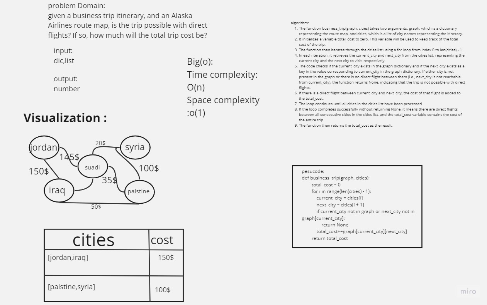

# bussines trip

## Whiteboard Process

## Approach & Efficiency:
***Time --> O(n)*** where n is the number of cities in the cities list
---

***space -->O(1)*** 
---

---

## Solution

[Graph](./graph.py)