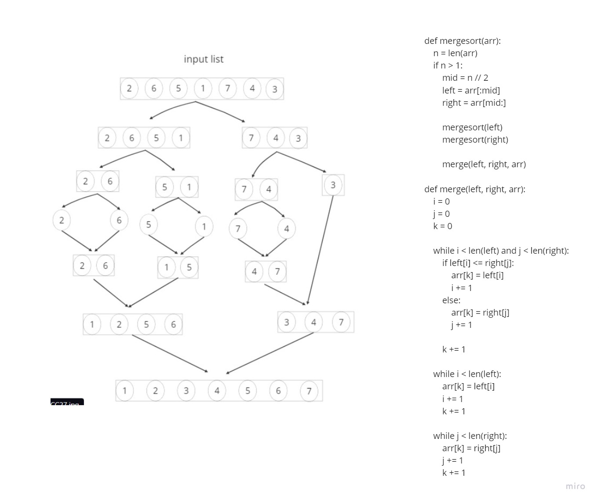

# Merge-Sort

# Whiteboard Process


### to test code 
install pytest to run the test
 ```
 pytest
 ```

 
def merge_sort(arr):
    if len(arr) > 1:
        mid = len(arr) // 2
        left = arr[:mid]
        right = arr[mid:]

        merge_sort(left)
        merge_sort(right)

        merge(left, right, arr)
    return arr

def merge(left, right, arr):
    i = 0
    j =0
    k = 0

    while i < len(left) and j < len(right):
        if left[i] <= right[j]:
            arr[k] = left[i]
            i += 1
        else:
            arr[k] = right[j]
            j += 1
        k += 1
    # if i ==len(left):
    #     arr[k:]=right[j:]
    # else:
    #     arr[k:]=left[i:]

    while i < len(left):
        arr[k] = left[i]
        i += 1
        k += 1

    while j < len(right):
        arr[k] = right[j]
        j += 1
        k += 1
